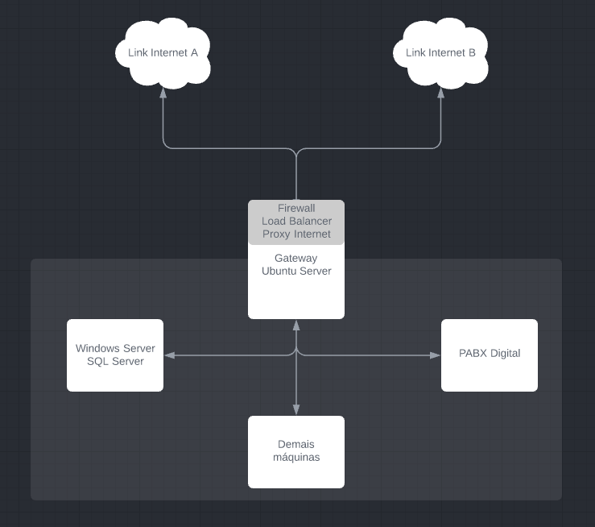

# Servidor de Internet Linux com Load Balancer e Failover

Automatizar a configuração de um servidor de internet Linux (gateway, firewall, load-balancer) 

# Passo 1 - Dependências

### Dependências na Máquina Alvo
- Ubuntu 20.04
- Python 3.8.8

### Dependências na Máquina Local
- ansible [core 2.11.2]
- community.general collection (Role Ansible disponível em Ansible Galaxy)
- ansible.posix collection (Role Ansible disponível em Ansible Galaxy)
- sshpass

# Passo 2 - Preencher Arquivos de Configuração e Variáveis

- Arquivo roles/gateway/files/router.yaml (Arquivo de configuração NetPlan) \
    Preencher interfaces de rede \
    Preencher endereço de ip \
    preencher endereço de dns 

- Arquivo roles/gateway/files/balanceamento.sh \
    Preencher as variáveis \
    Preencher regras de iptables conforme necessidade 

- Arquivo roles/gateway/files/failover.sh \
    Preencher enterface de rede em isp_1 e isp_2 \
    Preencher endereços de ip gateway_1 e gateway2 

- Arquivo roles/gateway/files/redir.sh \
    Preencher redirecionamentos de porta 

- Arquivo roles/gateway/vars/main.yml \
    Caso queira alterar, precisa buscar dependências em outros arquivos 

- Editar inventory \
    Informações de IP e/ou domínio das máquinas alvo \
    Usuário ssh caso não queira utilizar parâmetro -u no ansible \
    Caminho para a chave ssh 
    
# Passo 3 - Instalar dependências
- sshpass \
    `sudo apt install sshpass`
    
- community.general collection \
    `ansible-galaxy collection install community.general`
    
- ansible.posix collection \
    `ansible-galaxy collection install ansible.posix`

    
# Passo 3 - Rodar Playbook
- Para executar utilize o comando \
    `ansible-playbook main.yml -K` \
    O comando precisa ser executado na pasta raiz do repositório \
    O arquivo ansible.cfg está configurado inidicando o inventario, assim não precisa utlizar `-i inventory` \
    Se preenchido o usuário ssh no arquivo inventory não há necessidade de utilizar o parâmetro `-u usuário` 
    

     
